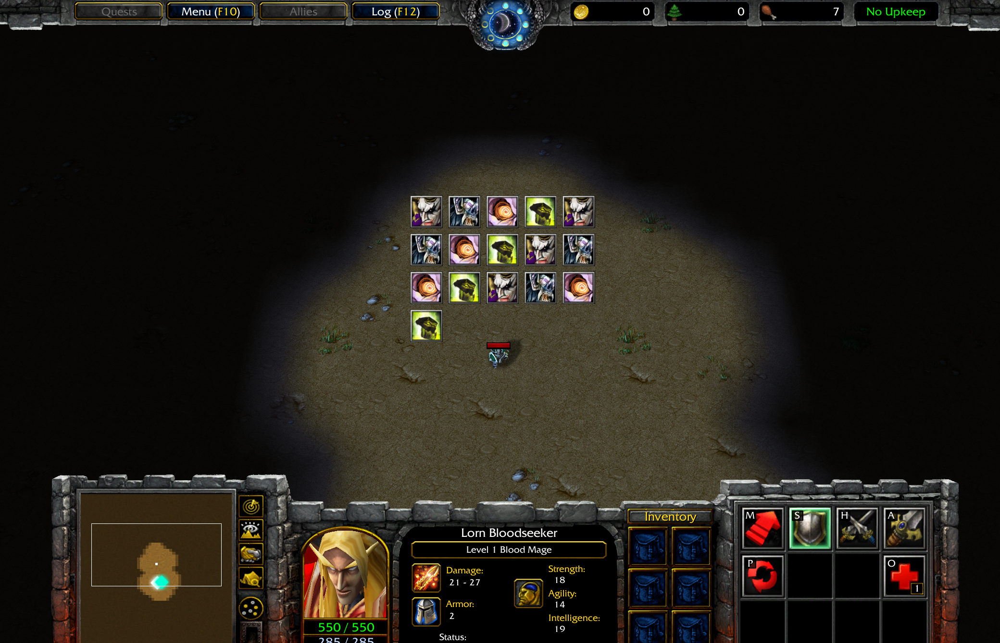
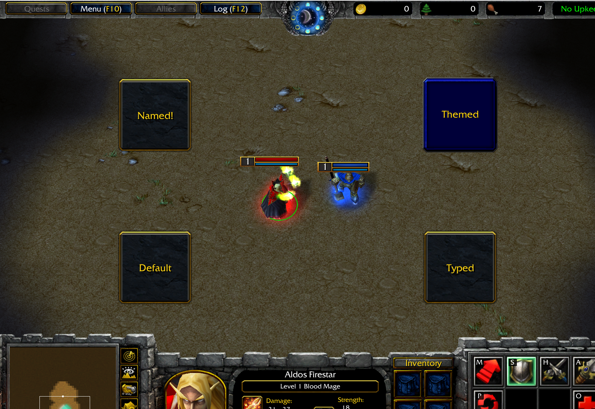
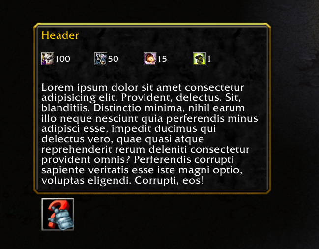

# Warcraft w3ts Frame Components

A library for reusable and composable frame components for modding the game of Warcraft 3.

Primarily uses frames from the category of FRAME.

The components help to reduce the boiler plate code needed when working with frames.

# Important

The library is still in early development and is subject to major breaking changes.

# <a id="contents">Contents</a>

- [About Components](#about-components)
- [Components](#components-toc)
- [Theme](#theme)
- [Caveats](#caveats)
- [Frame definitions and TOC Files](#frame-definitions-and-toc-files)

## <a id="about-components">About Components</a> - [🔝](#contents)

When a component is created, by default, it will be placed in center of the screen so that it is visible.
This is just for quickly seeing the component rendered.

Most of the internal frames inside components are public so you may make modifications as you see fit.

All components have a name, owner, inherits and container frame.

If the inherits property is any string, including the empty string, then the frame is created like so.
When created this way, the name arugment can be any custom name you want.

```ts
BlzCreateFrameByType(...)
```

If the inherits property is undefined, then the frame is created by name with this native.
This means the name argument must be a named blizzard frame.

```ts
BlzCreateFrame(...)
```

### Properties

- ##### Container Frame
    - The container frame is typically an EMPTY or BACKDROP frame type and serves as your primary reference frame which is the parent of any children frames within the conmponent.

- ##### Name
    - A simple string whose name is typically composed of the name + player index (context) + the component name.
    - The name must not be the name of a simple frame type name.

- ##### Owner
    - Most frames here will have a default owner of `ORIGIN_FRAME_GAME_UI` if one is not provided.

- ##### Inherits
    - Defaults to empty string when not set.

- ##### Priority
    - Defaults to 0. Only used when creating a frame by name.

## <a id="components-toc">Components</a> - [🔝](#contents)

- #### [Grid](#grid)
- #### [Button](#button)
- #### [Glue Text Button](#glue-text-button)
- #### [Icon](#icon)
- #### [Backdrop](#backdrop)
- #### [Empty Frame](#empty-frame)
- #### [Text Area](#text-area)
- #### [Text](#text)
- #### [Tooltip](#tooltip)

### <a id="grid">Grid</a> - [🔝](#components-toc)

The grid component provides a versatile layout tool for organizing a collection of like frames.

Each grid item can contain any frame type or custom frame components.

The grid provides a render function which is used for the initial rendering of the grid.



<details>
<summary> Code Example</summary>

```ts
const testData: string[] = [
    "ReplaceableTextures\\CommandButtons\\BTNTichondrius.blp",
    "ReplaceableTextures\\CommandButtons\\BTNGargoyle.blp",
    "ReplaceableTextures\\CommandButtons\\BTNUnholyFrenzy.blp",
    "ReplaceableTextures\\CommandButtons\\BTNInfernal.blp",
];

const g = new Grid<string, GridItemBaseDefinition>(
    {
        columns: 4,
        rows: 1,
        data: testData,
        renderItem(parent, row, column, index, data) {
            if (!data) {
                return;
            }

            const icon = new Icon(data, "", 0, parent);
            icon.frame?.setSize(0.03, 0.03);

            return { container: icon.frame };
        },
    },
    "iconGridName",
    0,
);

g.containerFrame?.clearPoints();
g.containerFrame?.setAbsPoint(FRAMEPOINT_CENTER, 0.4, 0.5);
```

</details>

### <a id="button">Button</a> - [🔝](#components-toc)

When on click is set, it will automatically enable and disable the button so that it does not retain focus after being clicked.

When on click and a sound path is set, the sound will be played locally for the player.

### <a id="glue-text-button">Glue Text Button</a> - [🔝](#components-toc)

When on click is set, it will automatically enable and disable the button so that it does not retain focus after being clicked.

When on click and a sound path is set, the sound will be played locally for the player.



<details>
<summary> Code Example</summary>

```ts
const gb1 = GlueTextButton.CreateDefault(0);
gb1.frame?.clearPoints();
gb1.frame?.setAbsPoint(FRAMEPOINT_CENTER, 0.2, 0.25);

const gb2 = GlueTextButton.CreateType("", 0, "ScriptDialogButton", undefined, { initialText: "Typed", clickSoundPath: "Units\\Undead\\Ghoul\\GhoulYesAttack4.flac" });
gb2.frame?.clearPoints();
gb2.frame?.setAbsPoint(FRAMEPOINT_CENTER, 0.6, 0.25);

const gb3 = GlueTextButton.CreateNamed("ScriptDialogButton", 0, undefined, 0, { initialText: "Named!" });
gb3.frame?.clearPoints();
gb3.frame?.setAbsPoint(FRAMEPOINT_CENTER, 0.2, 0.45);

GlueTextButton.SaveTheme({
    clickSoundPath: "Units\\Undead\\Abomination\\AbominationYesAttack1.flac",
    inherits: "DebugButton",
});

const gb4 = GlueTextButton.CreateThemed("custom-name", 0, undefined, { initialText: "Themed" });
gb4.frame?.clearPoints();
gb4.frame?.setAbsPoint(FRAMEPOINT_CENTER, 0.6, 0.45);
```

</details>

### <a id="icon">Icon</a> - [🔝](#components-toc)

A simle component which displays a texture icon.

### <a id="backdrop">Backdrop</a> - [🔝](#components-toc)

A simple wrapper for a backdrop frame.

### <a id="empty-frame">Empty Frame</a> - [🔝](#components-toc)

A simple wrapper for a backdrop frame.

### <a id="text-area">Text Area</a> - [🔝](#components-toc)

When on mouse enter is set, it will automatically enable and disable the textarea so that it does not retain focus after being clicked.

### <a id="text">Text</a> - [🔝](#components-toc)

A basic component for text frames with additional built in functionality for automatic sizing.

### <a id="tooltip">Tooltip</a> - [🔝](#components-toc)

Simplifies tooltip creation.

It also provides a way for users to add their own icons and text to the tooltip which is displayed under the tooltip header.

Handles automatic resizing of tooltip background when changing header and body text.



<details>
<summary> Code Example</summary>

```ts
const b1 = new Button({ texture: "ReplaceableTextures\\CommandButtons\\BTNSelectHeroOn" }, "", 0, undefined, "");
b1.buttonFrame?.clearPoints();
b1.buttonFrame?.setAbsPoint(FRAMEPOINT_CENTER, 0.1, 0.2);

const ttBody =
    "Lorem ipsum dolor sit amet consectetur adipisicing elit. Provident, delectus. Sit, blanditiis. Distinctio minima, nihil earum illo neque nesciunt quia perferendis minus adipisci esse, impedit ducimus qui delectus vero, quae quasi atque reprehenderit rerum deleniti consectetur provident omnis? Perferendis corrupti sapiente veritatis esse iste magni optio, voluptas eligendi. Corrupti, eos!";
const tooltipData = [
    {
        texture: "ReplaceableTextures\\CommandButtons\\BTNTichondrius.blp",
        value: "100",
    },
    {
        texture: "ReplaceableTextures\\CommandButtons\\BTNGargoyle.blp",
        value: "50",
    },
    {
        texture: "ReplaceableTextures\\CommandButtons\\BTNUnholyFrenzy.blp",
        value: "15",
    },
    {
        texture: "ReplaceableTextures\\CommandButtons\\BTNInfernal.blp",
        value: "1",
    },
];

const tt = new Tooltip("|cffffcc00Header|r", ttBody, "", 0, b1.buttonFrame, {
    tooltipIconGridData: tooltipData,
    tooltipIconContainerGapX: 0.005,
    tooltipIconValueLeftPadding: 0,
    tooltipBodySpaceX: 0.01,
    tooltipHeaderSpaceX: 0.01,
});
```

</details>

## <a id="theme">Theme</a> - [🔝](#contents)

A theme may be specified which will be applied to all appropriate elements based on which theme settings are configured.

### Global Themes

```ts
W3TSFrameComponentsThemeUtils.createTheme({
    backdropInherits: "LadderButtonBackdropTemplate",
    glueButtonClickSound: "Sound\\Interface\\BigButtonClick.flac",
    glueTextButtonInherits: "ScriptDialogButton",
});
```

### Component Themes

Component level themes allow you to save a configuration for the component as a theme.

```ts
GlueTextButton.SaveTheme(...)
```

Afterwars, you can create a component with the theme applied using CreateThemed.

```ts
GlueTextButton.CreateThemed(...);
```

### Overrides

Theme configurations may have specific properties overriden as well if you want slight variations based on the theme.

```ts
const overrides = {...}

GlueTextButton.CreateThemed(..., overrides)
```

## <a id="caveats">Caveats</a> - [🔝](#contents)

All frames that are created are permanent and will never be deleted. This is to prevent desyncs and game crashes.

There is only 1 case where a SIMPLE frame type is used, which is optional when creating a button.

## <a id="frame-definitions-and-toc-files">Frame definitions and TOC Files</a> - [🔝](#contents)

This library comes with it's own frame definitions files and TOC.

These are optional to use and not required.

The files provide a sleeker look for backdrop borders and backgrounds, glue buttons, text areas and scrollbars.
