# Warcraft w3ts Frame Components

A library of reusable frame components for Warcraft III maps built with w3ts.
It provides wrappers around Blizzard frame types and higher-level components
composed from those wrappers.

> The library is under active development. The public API may change between
> releases.

## <a id="contents">Contents</a>

- [Architecture](#architecture)
- [Components](#components-toc)
- [Debugging tools](#debugging-tools)
- [Caveats](#caveats)
- [Frame definitions and TOC files](#frame-definitions-and-toc-files)

## <a id="architecture">Architecture</a> - [🔝](#contents)

#### <a id="mono-frame">MonoFrame</a> - [🔝](#contents)

`MonoFrame` descendants wrap one Blizzard frame. They expose the underlying
`Frame` through `frame` and use component-specific configuration objects.

Use `CreateType` with `inherits: ""` to create a bare non-simple Blizzard
frame without loading an FDF. Use `CreateNamed` only when an application
intentionally needs a loaded top-level FDF template and its configured child
structure. Both accept an `overrides` object for component configuration.
Calling a component event setter again replaces the existing handler for that
frame event; its prior native trigger is destroyed before the replacement is
registered.

```ts
import { ButtonFrame } from "warcraft-3-w3ts-frame-components";

const button = ButtonFrame.CreateType({
    context: 0,
    inherits: "",
    overrides: {
        texture: "ReplaceableTextures\\CommandButtons\\BTNSelectHeroOn",
    },
});

button.frame?.clearPoints();
button.frame?.setAbsPoint(FRAMEPOINT_CENTER, 0.2, 0.3);
```

Most mono frames wrap native Blizzard frame types. The library wraps supported independently creatable non-simple Blizzard frame
types documented by the default FDF catalog. `EmptyFrame` is the wrapper for
`FRAME`.

| Native behavior               | Components                                                                 |
| ----------------------------- | -------------------------------------------------------------------------- |
| Containers and passive frames | `ChatDisplayFrame`, `HighlightFrame`, `ListBoxFrame`, `MenuFrame`          |
| Buttons and toggles           | `GlueButtonFrame`, `TextButtonFrame`, `CheckBoxFrame`, `GlueCheckBoxFrame` |
| Text input                    | `EditBoxFrame`, `GlueEditBoxFrame`, `SlashChatBoxFrame`                    |
| Selection and values          | `PopupMenuFrame`, `GluePopupMenuFrame`, `SliderFrame`, `ScrollBarFrame`    |
| Dialogs and model displays    | `DialogFrame`, `ModelFrame`, `SpriteFrame`                                 |
| Timer text                    | `TimerTextFrame`                                                           |

All wrappers expose `CreateType` and `CreateNamed`. The default construction
path is typed creation with an empty `inherits` string, which requires no FDF.
Use named creation only when a loaded top-level FDF template is deliberately
needed for its configured child hierarchy or appearance; never add an FDF just
to instantiate one of these native frame types. `SIMPLE*` types are
intentionally excluded because they require the distinct simple-frame creation
path, and `BASE` is excluded because native typed creation fails for it.

Typed construction proves that the native base frame exists; it does not
manufacture optional FDF child hierarchies. For example, dialog accept/cancel
buttons and popup menu options require a caller-supplied template when an
application needs those higher-level behaviors.

Frames that need an FDF to render completely are marked with a `@requiresFdf`
JSDoc tag on the class and its `CreateNamed` / `CreateType` functions:
`DialogFrame`, `ListBoxFrame`, `MenuFrame`, `PopupMenuFrame`,
`GluePopupMenuFrame`, `SliderFrame`, `ScrollBarFrame`, `CheckBoxFrame`,
`GlueCheckBoxFrame`, `ChatDisplayFrame`, `HighlightFrame`, `TextButtonFrame`,
`GlueTextButtonFrame`, and `TextAreaFrame`. This is based on Tasyen's per-type
FDF documentation and has not been fully verified in-game.

Examples use `CreateType` with `inherits: ""` for bare frames, and placeholder
template names such as `MyDialogTemplate` where you must supply your own loaded
FDF. Each mono frame has its own section below.

#### <a id="composite-frame">CompositeFrame</a> - [🔝](#contents)

`CompositeFrame` descendants assemble mono and/or other composite components.
Their `containerFrame` is the frame that controls the component as a whole,
and `childFrames` retains the components created during rendering.

Composite components use `Create` with an optional `overrides` configuration:

```ts
import { TimerFrame } from "warcraft-3-w3ts-frame-components";

const timer = TimerFrame.Create({
    context: 0,
    overrides: {
        iconTexture: "ReplaceableTextures\\CommandButtons\\BTNTichondrius.blp",
        timerTitle: "Hero respawn",
    },
});

timer.start(10);
```

## <a id="components-toc">Components</a> - [🔝](#contents)

**[Grid](#grid)**

#### <a id="mono-frames">Mono frames</a> - [🔝](#components-toc)

**[BackdropFrame](#backdrop-frame)**

**[ButtonFrame](#button-frame)**

**[ChatDisplayFrame](#chat-display-frame)**

**[CheckBoxFrame](#check-box-frame)**

**[DialogFrame](#dialog-frame)**

**[EditBoxFrame](#edit-box-frame)**

**[EmptyFrame](#empty-frame)**

**[GlueButtonFrame](#glue-button-frame)**

**[GlueCheckBoxFrame](#glue-check-box-frame)**

**[GlueEditBoxFrame](#glue-edit-box-frame)**

**[GluePopupMenuFrame](#glue-popup-menu-frame)**

**[GlueTextButtonFrame](#glue-text-button-frame)**

**[HighlightFrame](#highlight-frame)**

**[IconFrame](#icon-frame)**

**[ListBoxFrame](#list-box-frame)**

**[MenuFrame](#menu-frame)**

**[ModelFrame](#model-frame)**

**[PopupMenuFrame](#popup-menu-frame)**

**[ScrollBarFrame](#scroll-bar-frame)**

**[SlashChatBoxFrame](#slash-chat-box-frame)**

**[SliderFrame](#slider-frame)**

**[SpriteFrame](#sprite-frame)**

**[TextAreaFrame](#text-area-frame)**

**[TextButtonFrame](#text-button-frame)**

**[TextFrame](#text-frame)**

**[TimerTextFrame](#timer-text-frame)**

#### <a id="composite-frames">Composite frames</a> - [🔝](#components-toc)

**[TimerFrame](#timer-frame)**

**[TooltipFrame](#tooltip-frame)**

<hr />

#### <a id="grid">Grid</a> - [🔝](#components-toc)

`Grid` arranges like items using caller-provided render and update callbacks.
Each rendered item must return a `container` frame that the grid can position.
Sparse data arrays are not supported.


<details>
<summary>Code Example</summary>

```ts
import { Grid, IconFrame, IGridItemBaseDefinition } from "warcraft-3-w3ts-frame-components";

interface IconGridItem extends IGridItemBaseDefinition {
    icon: IconFrame;
}

const textures = ["ReplaceableTextures\\CommandButtons\\BTNTichondrius.blp", "ReplaceableTextures\\CommandButtons\\BTNGargoyle.blp"];

const grid = new Grid<string, IconGridItem>(
    {
        columns: 2,
        data: textures,
        rows: 1,
        renderItem(parent, _row, _column, index, texture) {
            const icon = IconFrame.CreateType({
                context: 0,
                inherits: "",
                name: `GridIcon${index}`,
                owner: parent,
                overrides: { texture },
            });

            icon.frame?.setSize(0.03, 0.03);
            return { container: icon.frame, icon };
        },
        updateItem(texture, item) {
            item.icon.updateTexture(texture);
        },
    },
    "ExampleGrid",
    0,
);

grid.containerFrame?.clearPoints();
grid.containerFrame?.setAbsPoint(FRAMEPOINT_CENTER, 0.4, 0.5);
```

</details>

#### <a id="backdrop-frame">BackdropFrame</a> - [🔝](#mono-frames)

`BackdropFrame` is a lightweight wrapper around a Blizzard backdrop frame.

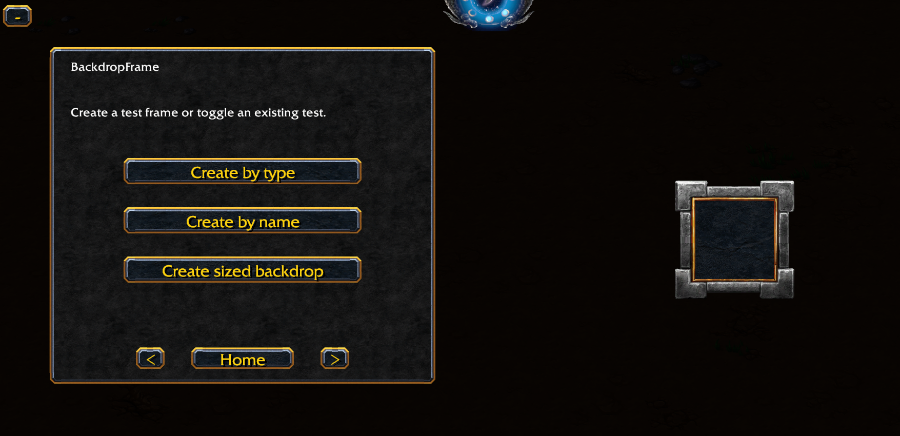
<details>
<summary>Code Example</summary>

```ts
import { BackdropFrame } from "warcraft-3-w3ts-frame-components";

const backdrop = BackdropFrame.CreateType({
    context: 0,
    inherits: "QuestButtonBaseTemplate",
});
backdrop.frame?.setSize(0.2, 0.1);
backdrop.frame?.setAbsPoint(FRAMEPOINT_CENTER, 0.4, 0.3);
```

</details>

#### <a id="button-frame">ButtonFrame</a> - [🔝](#mono-frames)

`ButtonFrame` wraps a Blizzard button and exposes `setOnClick` for click
handlers. When configured with `clickSoundPath`, the sound is played locally
for the clicking player.

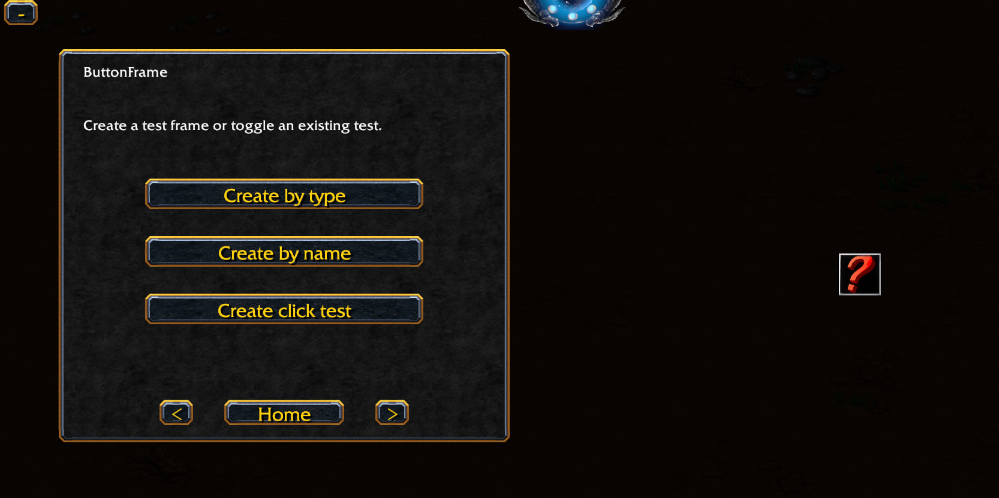
<details>
<summary>Code Example</summary>

```ts
import { ButtonFrame } from "warcraft-3-w3ts-frame-components";

const button = ButtonFrame.CreateType({
    context: 0,
    inherits: "",
    overrides: {
        texture: "ReplaceableTextures\\CommandButtons\\BTNSelectHeroOn",
        onClick: () => print("Clicked"),
    },
});
button.frame?.setSize(0.04, 0.04);
button.frame?.setAbsPoint(FRAMEPOINT_CENTER, 0.4, 0.3);
button.setOnClick(() => print("Replacement handler"));
```

</details>

#### <a id="chat-display-frame">ChatDisplayFrame</a> - [🔝](#mono-frames)

**Requires FDF** ❗

<details>
<summary>Code Example</summary>

```ts
import { ChatDisplayFrame } from "warcraft-3-w3ts-frame-components";

const chat = ChatDisplayFrame.CreateType({
    context: 0,
    inherits: "MyChatDisplayTemplate",
    overrides: { initialMessages: ["Welcome"] },
});
chat.addMessage("Another message");
```

</details>

#### <a id="check-box-frame">CheckBoxFrame</a> - [🔝](#mono-frames)

**Requires FDF** ❗
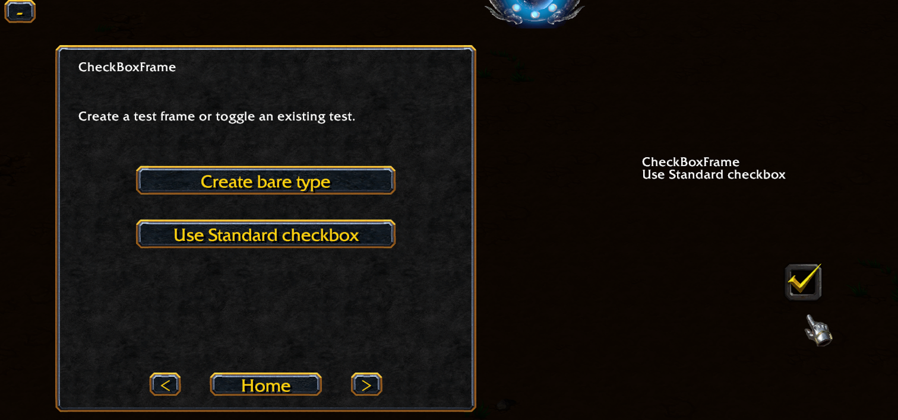
<details>
<summary>Code Example</summary>

```ts
import { CheckBoxFrame } from "warcraft-3-w3ts-frame-components";

const checkBox = CheckBoxFrame.CreateType({
    context: 0,
    inherits: "StandardCheckBoxTemplate",
    overrides: {
        onChecked: () => print("Checked"),
        onUnchecked: () => print("Unchecked"),
    },
});
```

</details>

#### <a id="dialog-frame">DialogFrame</a> - [🔝](#mono-frames)

**Requires FDF** ❗

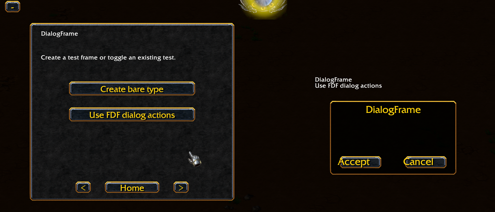
<details>
<summary>Code Example</summary>

```ts
import { DialogFrame } from "warcraft-3-w3ts-frame-components";

const dialog = DialogFrame.CreateType({
    context: 0,
    inherits: "MyDialogTemplate",
    overrides: {
        onAccept: () => print("Accepted"),
        onCancel: () => print("Cancelled"),
    },
});
```

</details>

#### <a id="edit-box-frame">EditBoxFrame</a> - [🔝](#mono-frames)

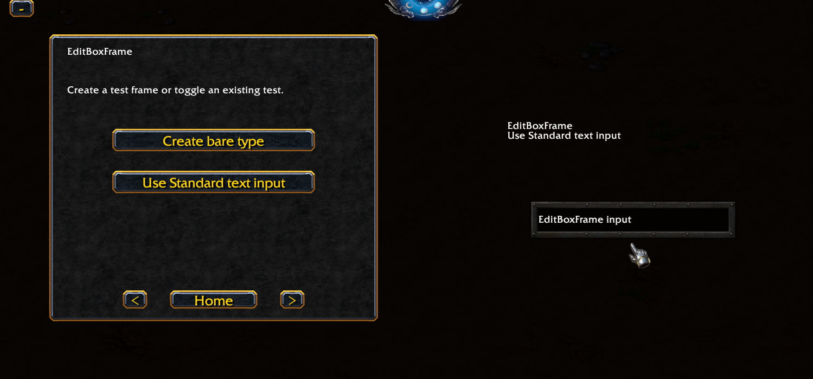
<details>
<summary>Code Example</summary>

```ts
import { EditBoxFrame } from "warcraft-3-w3ts-frame-components";

const editBox = EditBoxFrame.CreateType({
    context: 0,
    inherits: "StandardEditBoxTemplate",
    overrides: {
        initialText: "Type here",
        onEnter: (text) => print(`Entered: ${text}`),
        onTextChanged: (text) => print(`Changed: ${text}`),
    },
});
editBox.updateText("Reset");
```

</details>

#### <a id="empty-frame">EmptyFrame</a> - [🔝](#mono-frames)

`EmptyFrame` creates an invisible generic frame that can be used as a
container for positioning related frames.

<details>
<summary>Code Example</summary>

```ts
import { EmptyFrame } from "warcraft-3-w3ts-frame-components";

const container = EmptyFrame.CreateType({ context: 0, inherits: "" });
container.frame?.setSize(0.3, 0.2);
container.frame?.setAbsPoint(FRAMEPOINT_CENTER, 0.4, 0.3);
```

</details>

#### <a id="glue-button-frame">GlueButtonFrame</a> - [🔝](#mono-frames)

<details>
<summary>Code Example</summary>

```ts
import { GlueButtonFrame } from "warcraft-3-w3ts-frame-components";

const button = GlueButtonFrame.CreateType({
    context: 0,
    inherits: "",
    overrides: { onClick: () => print("Glue button clicked") },
});
button.setOnClick(() => print("Replacement handler"));
```

</details>

#### <a id="glue-check-box-frame">GlueCheckBoxFrame</a> - [🔝](#mono-frames)

**Requires FDF** ❗

<details>
<summary>Code Example</summary>

```ts
import { GlueCheckBoxFrame } from "warcraft-3-w3ts-frame-components";

const checkBox = GlueCheckBoxFrame.CreateType({
    context: 0,
    inherits: "EscMenuCheckBoxTemplate",
    overrides: { onChecked: () => print("Checked") },
});
checkBox.setOnUnchecked(() => print("Unchecked"));
```

</details>

#### <a id="glue-edit-box-frame">GlueEditBoxFrame</a> - [🔝](#mono-frames)
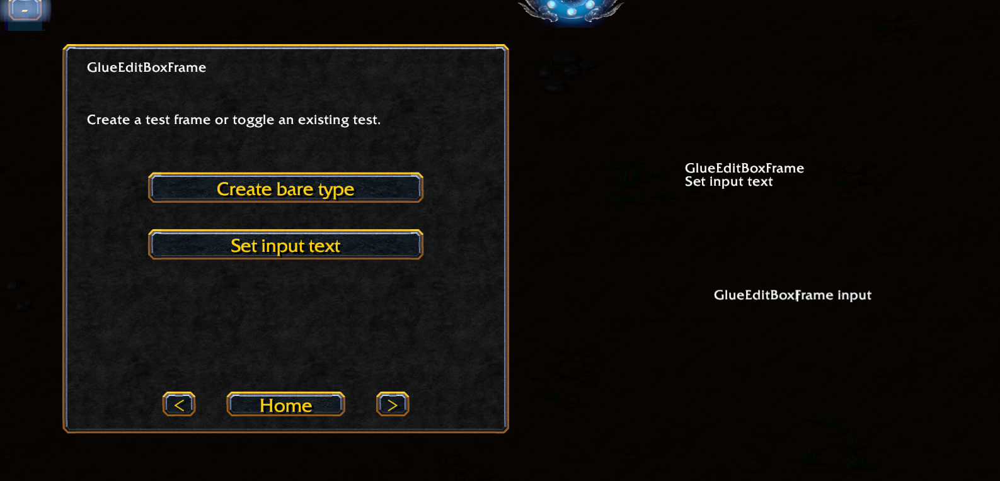
<details>
<summary>Code Example</summary>

```ts
import { GlueEditBoxFrame } from "warcraft-3-w3ts-frame-components";

const editBox = GlueEditBoxFrame.CreateType({
    context: 0,
    inherits: "",
    overrides: { onEnter: (text) => print(`Entered: ${text}`) },
});
editBox.setOnTextChanged((text) => print(`Changed: ${text}`));
```

</details>

#### <a id="glue-popup-menu-frame">GluePopupMenuFrame</a> - [🔝](#mono-frames)

**Requires FDF** ❗

<details>
<summary>Code Example</summary>

```ts
import { GluePopupMenuFrame } from "warcraft-3-w3ts-frame-components";

const popup = GluePopupMenuFrame.CreateType({
    context: 0,
    inherits: "MyGluePopupMenuTemplate",
});
popup.setOnItemChanged((index) => print(`Selected item ${index}`));
```

</details>

#### <a id="glue-text-button-frame">GlueTextButtonFrame</a> - [🔝](#mono-frames)

`GlueTextButtonFrame` is the equivalent wrapper for glue text button frames.
It also supports `setOnClick` and optional local click sounds.

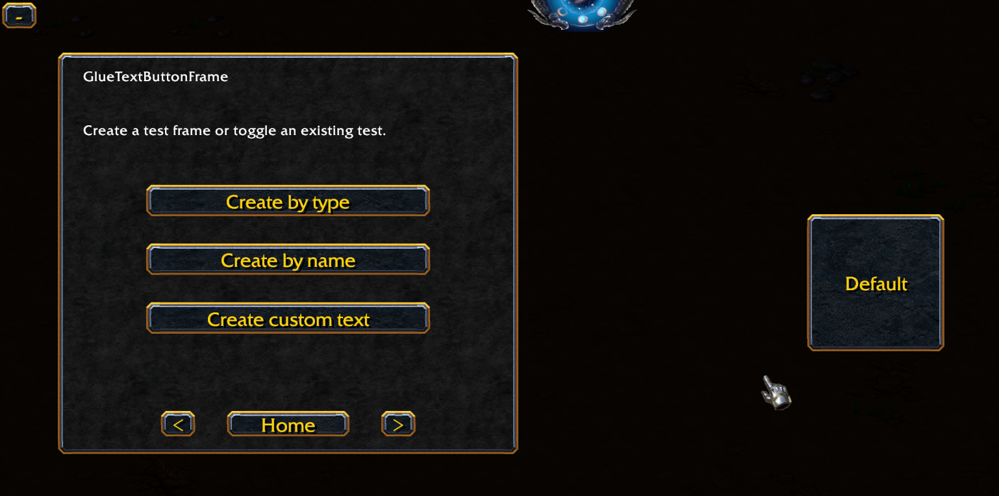

<details>
<summary>Code Example</summary>

```ts
import { GlueTextButtonFrame } from "warcraft-3-w3ts-frame-components";

const defaultButton = GlueTextButtonFrame.CreateType({
    context: 0,
    inherits: "ScriptDialogButton",
});
defaultButton.frame?.clearPoints();
defaultButton.frame?.setAbsPoint(FRAMEPOINT_CENTER, 0.2, 0.25);

const typedButton = GlueTextButtonFrame.CreateType({
    context: 0,
    inherits: "ScriptDialogButton",
    overrides: {
        clickSoundPath: "Units\\Undead\\Ghoul\\GhoulYesAttack4.flac",
        initialText: "Typed",
    },
});
typedButton.frame?.clearPoints();
typedButton.frame?.setAbsPoint(FRAMEPOINT_CENTER, 0.6, 0.25);

const namedButton = GlueTextButtonFrame.CreateNamed({
    context: 0,
    name: "ScriptDialogButton",
    overrides: { initialText: "Named!" },
});
namedButton.frame?.clearPoints();
namedButton.frame?.setAbsPoint(FRAMEPOINT_CENTER, 0.2, 0.45);

const customButton = GlueTextButtonFrame.CreateType({
    context: 0,
    inherits: "DebugButton",
    name: "CustomButton",
    overrides: {
        clickSoundPath: "Units\\Undead\\Abomination\\AbominationYesAttack1.flac",
        initialText: "Custom",
    },
});
customButton.frame?.clearPoints();
customButton.frame?.setAbsPoint(FRAMEPOINT_CENTER, 0.6, 0.45);
```

</details>

#### <a id="highlight-frame">HighlightFrame</a> - [🔝](#mono-frames)

**Requires FDF** ❗

<details>
<summary>Code Example</summary>

```ts
import { HighlightFrame } from "warcraft-3-w3ts-frame-components";

const highlight = HighlightFrame.CreateType({
    context: 0,
    inherits: "MyHighlightTemplate",
});
highlight.frame?.setSize(0.1, 0.1);
```

</details>

#### <a id="icon-frame">IconFrame</a> - [🔝](#mono-frames)

`IconFrame` displays a texture on a Blizzard button without registering a
click trigger. Use `updateTexture` to change the image after construction.

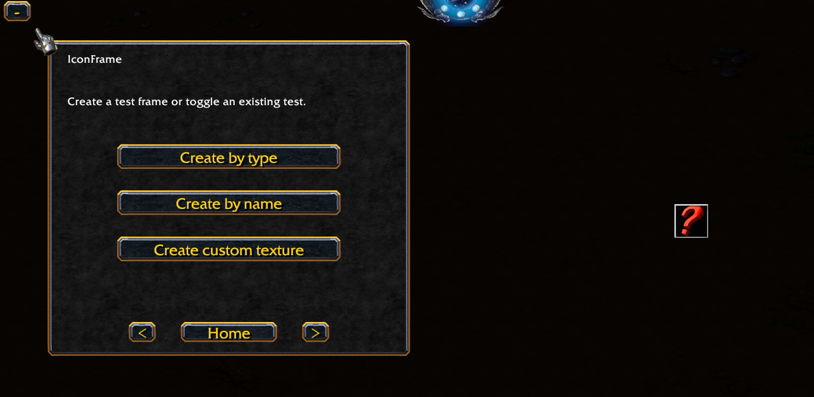

<details>
<summary>Code Example</summary>

```ts
import { IconFrame } from "warcraft-3-w3ts-frame-components";

const icon = IconFrame.CreateType({ context: 0, inherits: "" });
icon.frame?.setSize(0.04, 0.04);
icon.frame?.setAbsPoint(FRAMEPOINT_CENTER, 0.4, 0.3);
icon.updateTexture("ReplaceableTextures\\CommandButtons\\BTNSelectHeroOn");
```

</details>

#### <a id="list-box-frame">ListBoxFrame</a> - [🔝](#mono-frames)

**Requires FDF** ❗
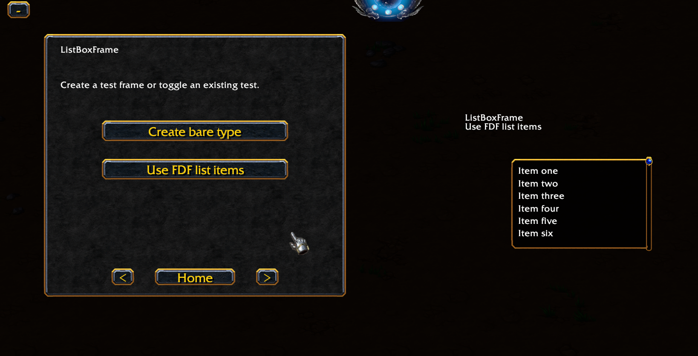
<details>
<summary>Code Example</summary>

```ts
import { ListBoxFrame } from "warcraft-3-w3ts-frame-components";

const list = ListBoxFrame.CreateType({
    context: 0,
    inherits: "MyListBoxTemplate",
});
list.frame?.setSize(0.2, 0.2);
```

</details>

#### <a id="menu-frame">MenuFrame</a> - [🔝](#mono-frames)

**Requires FDF** ❗

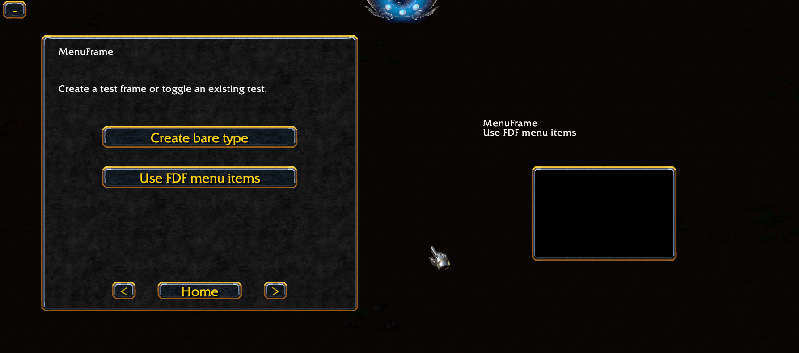
<details>
<summary>Code Example</summary>

```ts
import { MenuFrame } from "warcraft-3-w3ts-frame-components";

const menu = MenuFrame.CreateType({
    context: 0,
    inherits: "MyMenuTemplate",
});
menu.frame?.setSize(0.2, 0.2);
```

</details>

#### <a id="model-frame">ModelFrame</a> - [🔝](#mono-frames)

<details>
<summary>Code Example</summary>

```ts
import { ModelFrame } from "warcraft-3-w3ts-frame-components";

const model = ModelFrame.CreateType({
    context: 0,
    inherits: "",
    overrides: { modelPath: "units\\human\\Footman\\Footman.mdx", cameraIndex: 0 },
});
model.updateModel("units\\orc\\Grunt\\Grunt.mdx");
```

</details>

#### <a id="popup-menu-frame">PopupMenuFrame</a> - [🔝](#mono-frames)

**Requires FDF** ❗
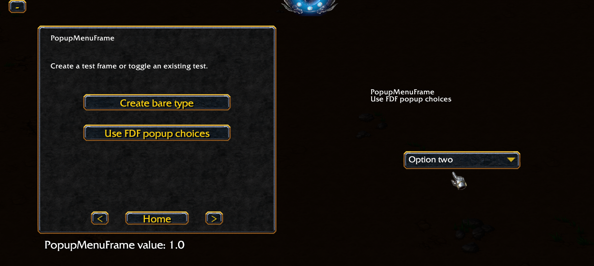
<details>
<summary>Code Example</summary>

```ts
import { PopupMenuFrame } from "warcraft-3-w3ts-frame-components";

const popup = PopupMenuFrame.CreateType({
    context: 0,
    inherits: "MyPopupMenuTemplate",
    overrides: { onItemChanged: (index) => print(`Selected item ${index}`) },
});
```

</details>

#### <a id="scroll-bar-frame">ScrollBarFrame</a> - [🔝](#mono-frames)

**Requires FDF** ❗

<details>
<summary>Code Example</summary>

```ts
import { ScrollBarFrame } from "warcraft-3-w3ts-frame-components";

const scrollBar = ScrollBarFrame.CreateType({
    context: 0,
    inherits: "EscMenuScrollBarTemplate",
    overrides: { onValueChanged: (value) => print(`Scroll: ${value}`) },
});
scrollBar.updateValue(10);
```

</details>

#### <a id="slash-chat-box-frame">SlashChatBoxFrame</a> - [🔝](#mono-frames)

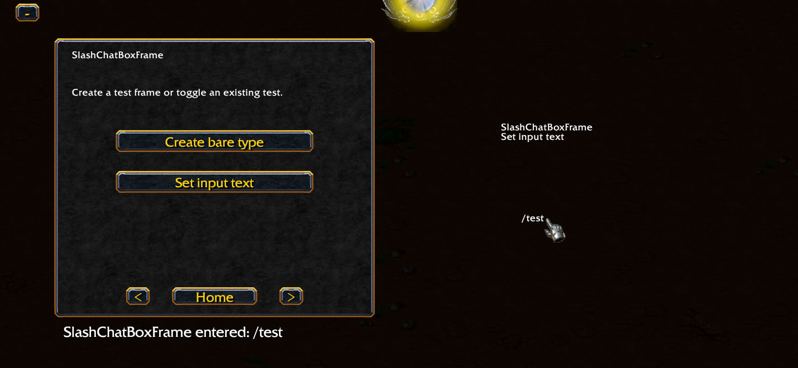
<details>
<summary>Code Example</summary>

```ts
import { SlashChatBoxFrame } from "warcraft-3-w3ts-frame-components";

const chatBox = SlashChatBoxFrame.CreateType({
    context: 0,
    inherits: "",
    overrides: { onEnter: (text) => print(`Submitted: ${text}`) },
});
```

</details>

#### <a id="slider-frame">SliderFrame</a> - [🔝](#mono-frames)

**Requires FDF** ❗
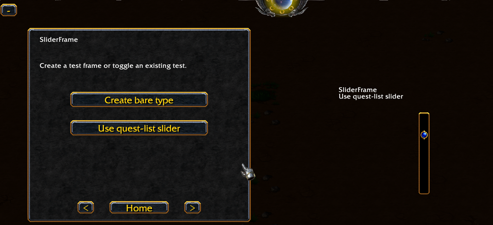
<details>
<summary>Code Example</summary>

```ts
import { SliderFrame } from "warcraft-3-w3ts-frame-components";

const slider = SliderFrame.CreateType({
    context: 0,
    inherits: "EscMenuSliderTemplate",
    overrides: {
        minValue: 0,
        maxValue: 100,
        stepSize: 5,
        initialValue: 50,
        onValueChanged: (value) => print(`Value: ${value}`),
    },
});
slider.updateValue(75);
```

</details>

#### <a id="sprite-frame">SpriteFrame</a> - [🔝](#mono-frames)

<details>
<summary>Code Example</summary>

```ts
import { SpriteFrame } from "warcraft-3-w3ts-frame-components";

const sprite = SpriteFrame.CreateType({
    context: 0,
    inherits: "",
    overrides: { modelPath: "UI\\Feedback\\Autocast\\UI-ModalButtonOn.mdx" },
});
sprite.setAnimation(0);
```

</details>

#### <a id="text-area-frame">TextAreaFrame</a> - [🔝](#mono-frames)
**Requires FDF** ❗

`TextAreaFrame` wraps a Blizzard text area. Its mouse-enter helper manages
enablement so the frame does not retain focus after interaction.
Use the optional `JMT_TextAreaTemplate` after loading the supplied FDF/TOC
assets when the text area needs a bordered visual container.
Warcraft III shows its scrollbar only when the content exceeds the text area's
visible height; `TextAreaMaxLines` limits retained lines but does not force the
scrollbar to appear.

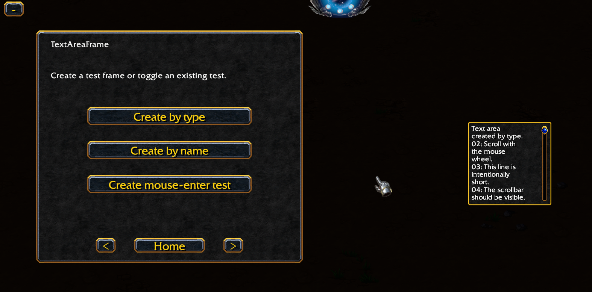

<details>
<summary>Code Example</summary>

```ts
import { TextAreaFrame } from "warcraft-3-w3ts-frame-components";

const area = TextAreaFrame.CreateType({
    context: 0,
    inherits: "JMT_TextAreaTemplate",
    overrides: { initialText: "Line one\nLine two" },
});
area.frame?.setSize(0.25, 0.12);
area.frame?.setAbsPoint(FRAMEPOINT_CENTER, 0.4, 0.3);
area.setOnMouseEnter(() => print("Mouse entered"));
```
</details>

#### <a id="text-button-frame">TextButtonFrame</a> - [🔝](#mono-frames)

**Requires FDF** ❗
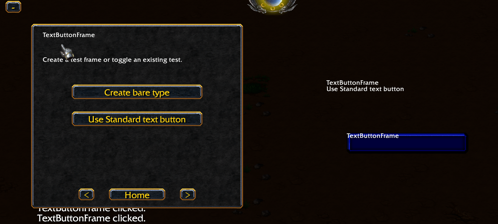
<details>
<summary>Code Example</summary>

```ts
import { TextButtonFrame } from "warcraft-3-w3ts-frame-components";

const button = TextButtonFrame.CreateType({
    context: 0,
    inherits: "StandardButtonTemplate",
    overrides: { initialText: "Confirm", onClick: () => print("Confirmed") },
});
button.updateText("Confirm again");
```

</details>

#### <a id="text-frame">TextFrame</a> - [🔝](#mono-frames)

`TextFrame` wraps a text frame and provides `update` and `formatSize` helpers
for automatic text sizing.

The examples for the frames below use `CreateType`. Frames marked **Requires FDF** ❗ render fully
only with a caller-supplied template loaded through
[`FrameUtils.LoadTOC`](#frame-definitions-and-toc-files); `MyXTemplate` names
are placeholders for your own templates. Position a frame with
`frame?.setAbsPoint(...)` as in the examples above.

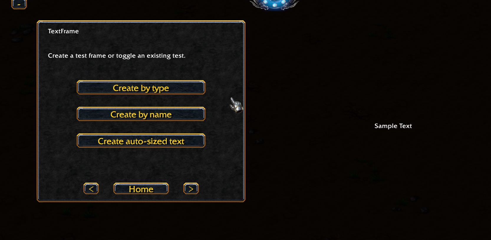

<details>
<summary>Code Example</summary>

```ts
import { TextFrame } from "warcraft-3-w3ts-frame-components";

const text = TextFrame.CreateType({
    context: 0,
    inherits: "",
    overrides: { initialText: "Hello", autoSizeWidth: true },
});
text.frame?.setAbsPoint(FRAMEPOINT_CENTER, 0.4, 0.3);
text.update("Updated text");
text.formatSize();
```

</details>


#### <a id="timer-text-frame">TimerTextFrame</a> - [🔝](#mono-frames)
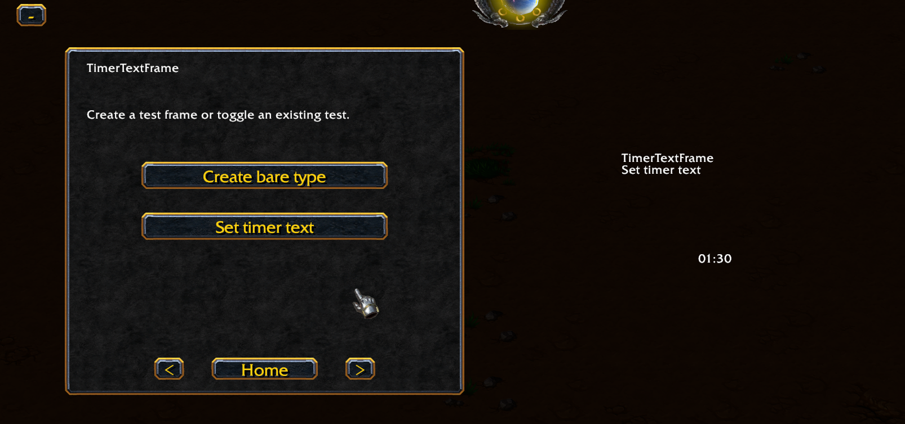
<details>
<summary>Code Example</summary>

```ts
import { TimerTextFrame } from "warcraft-3-w3ts-frame-components";

const timerText = TimerTextFrame.CreateType({
    context: 0,
    inherits: "",
    overrides: { initialText: "00:00" },
});
timerText.updateText("01:30");
```

</details>

#### <a id="timer-frame">TimerFrame</a> - [🔝](#composite-frames)

`TimerFrame` displays a countdown within a backdrop. Its optional decoration
is an `IconFrame`, not a clickable button. Supply `iconTexture` and
`iconTooltipText` when the icon should include a tooltip. Its title and
counter auto-size, and the backdrop expands when their combined content needs
more space than `backdropWidth`.

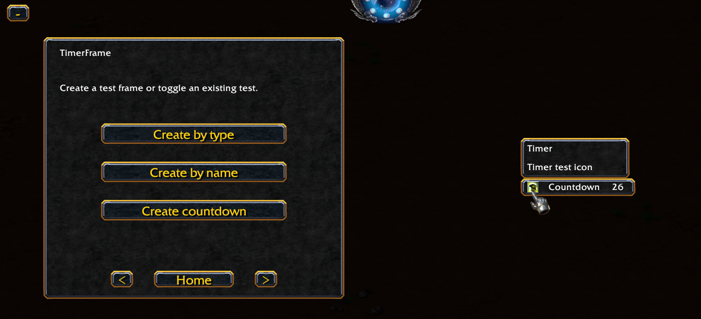

<details>
<summary>Code Example</summary>

```ts
import { TimerFrame } from "warcraft-3-w3ts-frame-components";

const timer = TimerFrame.Create({
    context: 0,
    overrides: {
        iconTexture: "ReplaceableTextures\\CommandButtons\\BTNInfernal.blp",
        iconTooltipText: "Hero respawn timer",
        timerTitle: "Respawn",
    },
});

timer.start(30, false, () => print("Respawn timer finished"));
```

</details>

#### <a id="tooltip-frame">TooltipFrame</a> - [🔝](#composite-frames)

`TooltipFrame` attaches a text-only tooltip or an optional backdrop tooltip to
an owner frame. When `includeBackground` is enabled, resource-style icon/value
data can be rendered beneath the header through `tooltipIconGridData`.
Set `anchorPoint: "bottom"` for owners near the top of the screen so the
tooltip opens beneath, rather than above, its owner.

Call `TooltipFrame#update(header, body, iconData)` to update the text and,
optionally, the grid data after construction.


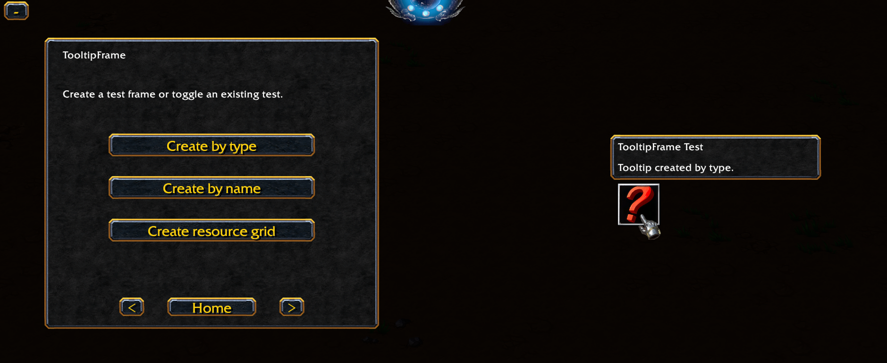

<details>
<summary>Code Example</summary>

```ts
import { ButtonFrame, TooltipFrame } from "warcraft-3-w3ts-frame-components";

const button = ButtonFrame.CreateType({
    context: 0,
    inherits: "",
    overrides: {
        texture: "ReplaceableTextures\\CommandButtons\\BTNSelectHeroOn",
    },
});

const tooltipData = [
    { texture: "ReplaceableTextures\\CommandButtons\\BTNTichondrius.blp", value: "100" },
    { texture: "ReplaceableTextures\\CommandButtons\\BTNGargoyle.blp", value: "50" },
];

if (button.frame) {
    const tooltip = TooltipFrame.Create({
        context: 0,
        owner: button.frame,
        overrides: {
            bodyText: "A tooltip body.",
            headerText: "|cffffcc00Header|r",
            includeBackground: true,
            tooltipBodySpaceX: 0.01,
            tooltipHeaderSpaceX: 0.01,
            tooltipIconContainerGapX: 0.005,
            tooltipIconGridData: tooltipData,
            tooltipIconValueLeftPadding: 0,
        },
    });
}
```

</details>


## <a id="debugging-tools">Debugging tools</a> - [🔝](#contents)

`FrameComponentTestHarness` is a paginated in-game harness that exercises each
component, and `FrameNavigator` (with `initFrameViewer`) inspects the live
frame tree. The harness needs the `FrameComponentTestHarness.toc` assets
loaded first; see `test\wc3-ts-template` for a working setup.

<details>
<summary>Code Example</summary>

```ts
import { FrameComponentTestHarness, FrameUtils } from "warcraft-3-w3ts-frame-components";

if (FrameUtils.LoadTOC("war3mapImported\\FrameComponentTestHarness.toc")) {
    const harness = new FrameComponentTestHarness();
}
```

</details>

## <a id="caveats">Caveats</a> - [🔝](#contents)

Frames created by the library are permanent and are not destroyed. This avoids
the desynchronization and stability risks associated with deleting Warcraft III
frames.

## <a id="frame-definitions-and-toc-files">Frame definitions and TOC files</a> - [🔝](#contents)

The library includes optional frame-definition and TOC files. They provide
custom styling for backdrops, glue buttons, text areas, and scrollbars, but
are not required to use the component API.

After importing a TOC and its referenced FDF files into the map, load it
before creating frames that inherit from its templates:

```ts
import { FrameUtils } from "warcraft-3-w3ts-frame-components";

if (!FrameUtils.LoadTOC("war3mapImported\\MyFrames.toc")) {
    print("Failed to load custom frame definitions.");
}
```
