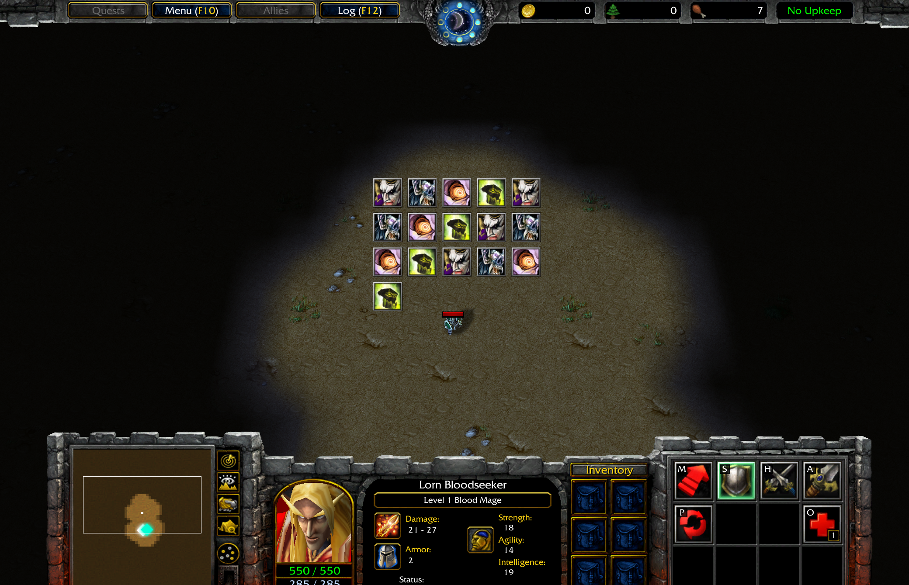
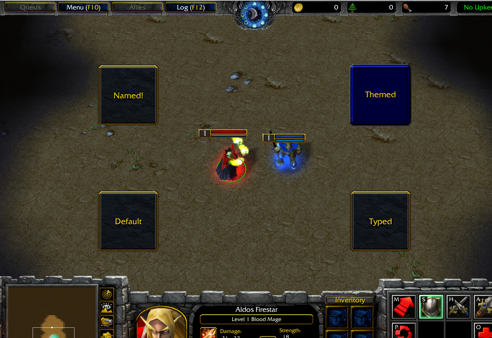
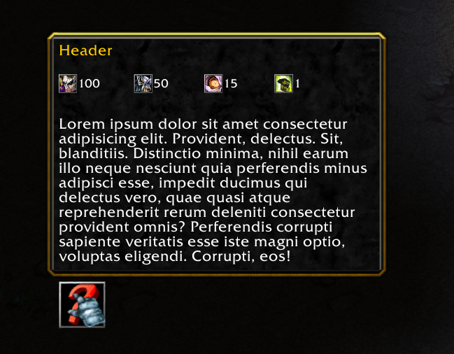

# Warcraft w3ts Frame Components

A library of reusable frame components for Warcraft III maps built with w3ts.
It provides wrappers around Blizzard frame types and higher-level components
composed from those wrappers.

> The library is under active development. The public API may change between
> releases.

## <a id="contents">Contents</a>

- [Architecture](#architecture)
- [Components](#components-toc)
- [Grid](#grid)
- [Tooltip](#tooltip)
- [Timer](#timer)
- [Caveats](#caveats)
- [Frame definitions and TOC files](#frame-definitions-and-toc-files)

## <a id="architecture">Architecture</a> - [🔝](#contents)

### <a id="mono-frame">MonoFrame</a> - [🔝](#contents)

`MonoFrame` descendants wrap one Blizzard frame. They expose the underlying
`Frame` through `frame` and use component-specific configuration objects.

Use `CreateType` with `inherits: ""` to create a bare non-simple Blizzard
frame without loading an FDF. Use `CreateNamed` only when an application
intentionally needs a loaded top-level FDF template and its configured child
structure. Both accept an `overrides` object for component configuration.
Calling a component event setter again replaces the existing handler for that
frame event; its prior native trigger is destroyed before the replacement is
registered.

```ts
import { ButtonFrame } from "warcraft-3-w3ts-frame-components";

const button = ButtonFrame.CreateType({
    context: 0,
    inherits: "",
    overrides: {
        texture: "ReplaceableTextures\\CommandButtons\\BTNSelectHeroOn",
    },
});

button.frame?.clearPoints();
button.frame?.setAbsPoint(FRAMEPOINT_CENTER, 0.2, 0.3);
```

### <a id="composite-frame">CompositeFrame</a> - [🔝](#contents)

`CompositeFrame` descendants assemble mono and/or other composite components.
Their `containerFrame` is the frame that controls the component as a whole,
and `childFrames` retains the components created during rendering.

Composite components use `Create` with an optional `overrides` configuration:

```ts
import { TimerFrame } from "warcraft-3-w3ts-frame-components";

const timer = TimerFrame.Create({
    context: 0,
    overrides: {
        iconTexture: "ReplaceableTextures\\CommandButtons\\BTNTichondrius.blp",
        timerTitle: "Hero respawn",
    },
});

timer.start(10);
```

## <a id="components-toc">Components</a> - [🔝](#contents)

**[Grid](#grid)**

### Mono frames - [🔝](#components-toc)

**[ButtonFrame](#button-frame)**

**[GlueTextButtonFrame](#glue-text-button-frame)**

**[IconFrame](#icon-frame)**

**[BackdropFrame](#backdrop-frame)**

**[EmptyFrame](#empty-frame)**

**[TextAreaFrame](#text-area-frame)**

**[TextFrame](#text-frame)**

**[Native MonoFrame wrappers](#native-mono-frame-wrappers)**

### <a id="native-mono-frame-wrappers">Native MonoFrame wrappers</a> - [🔝](#components-toc)

The library wraps supported independently creatable non-simple Blizzard frame
types documented by the default FDF catalog. `EmptyFrame` is the wrapper for
`FRAME`.

| Native behavior | Components |
|---|---|
| Containers and passive frames | `ChatDisplayFrame`, `HighlightFrame`, `ListBoxFrame`, `MenuFrame` |
| Buttons and toggles | `GlueButtonFrame`, `TextButtonFrame`, `CheckBoxFrame`, `GlueCheckBoxFrame` |
| Text input | `EditBoxFrame`, `GlueEditBoxFrame`, `SlashChatBoxFrame` |
| Selection and values | `PopupMenuFrame`, `GluePopupMenuFrame`, `SliderFrame`, `ScrollBarFrame` |
| Dialogs and model displays | `DialogFrame`, `ModelFrame`, `SpriteFrame` |
| Timer text | `TimerTextFrame` |

All wrappers expose `CreateType` and `CreateNamed`. The default construction
path is typed creation with an empty `inherits` string, which requires no FDF.
Use named creation only when a loaded top-level FDF template is deliberately
needed for its configured child hierarchy or appearance; never add an FDF just
to instantiate one of these native frame types. `SIMPLE*` types are
intentionally excluded because they require the distinct simple-frame creation
path, and `BASE` is excluded because native typed creation fails for it.

Typed construction proves that the native base frame exists; it does not
manufacture optional FDF child hierarchies. For example, dialog accept/cancel
buttons and popup menu options require a caller-supplied template when an
application needs those higher-level behaviors.

### Composite frames - [🔝](#components-toc)

**[TooltipFrame](#tooltip-frame)**

**[TimerFrame](#timer-frame)**

## <a id="grid">Grid</a> - [🔝](#components-toc)

`Grid` arranges like items using caller-provided render and update callbacks.
Each rendered item must return a `container` frame that the grid can position.
Sparse data arrays are not supported.



<details>
<summary>Code Example</summary>

```ts
import { Grid, IconFrame, IGridItemBaseDefinition } from "warcraft-3-w3ts-frame-components";

interface IconGridItem extends IGridItemBaseDefinition {
    icon: IconFrame;
}

const textures = [
    "ReplaceableTextures\\CommandButtons\\BTNTichondrius.blp",
    "ReplaceableTextures\\CommandButtons\\BTNGargoyle.blp",
];

const grid = new Grid<string, IconGridItem>(
    {
        columns: 2,
        data: textures,
        rows: 1,
        renderItem(parent, _row, _column, index, texture) {
            const icon = IconFrame.CreateType({
                context: 0,
                inherits: "",
                name: `GridIcon${index}`,
                owner: parent,
                overrides: { texture },
            });

            icon.frame?.setSize(0.03, 0.03);
            return { container: icon.frame, icon };
        },
        updateItem(texture, item) {
            item.icon.updateTexture(texture);
        },
    },
    "ExampleGrid",
    0,
);

grid.containerFrame?.clearPoints();
grid.containerFrame?.setAbsPoint(FRAMEPOINT_CENTER, 0.4, 0.5);
```

</details>

### <a id="button-frame">ButtonFrame</a> - [🔝](#components-toc)

`ButtonFrame` wraps a Blizzard button and exposes `setOnClick` for click
handlers. When configured with `clickSoundPath`, the sound is played locally
for the clicking player.

### <a id="glue-text-button-frame">GlueTextButtonFrame</a> - [🔝](#components-toc)

`GlueTextButtonFrame` is the equivalent wrapper for glue text button frames.
It also supports `setOnClick` and optional local click sounds.



<details>
<summary>Code Example</summary>

```ts
import { GlueTextButtonFrame } from "warcraft-3-w3ts-frame-components";

const defaultButton = GlueTextButtonFrame.CreateType({
    context: 0,
    inherits: "ScriptDialogButton",
});
defaultButton.frame?.clearPoints();
defaultButton.frame?.setAbsPoint(FRAMEPOINT_CENTER, 0.2, 0.25);

const typedButton = GlueTextButtonFrame.CreateType({
    context: 0,
    inherits: "ScriptDialogButton",
    overrides: {
        clickSoundPath: "Units\\Undead\\Ghoul\\GhoulYesAttack4.flac",
        initialText: "Typed",
    },
});
typedButton.frame?.clearPoints();
typedButton.frame?.setAbsPoint(FRAMEPOINT_CENTER, 0.6, 0.25);

const namedButton = GlueTextButtonFrame.CreateNamed({
    context: 0,
    name: "ScriptDialogButton",
    overrides: { initialText: "Named!" },
});
namedButton.frame?.clearPoints();
namedButton.frame?.setAbsPoint(FRAMEPOINT_CENTER, 0.2, 0.45);

const customButton = GlueTextButtonFrame.CreateType({
    context: 0,
    inherits: "DebugButton",
    name: "CustomButton",
    overrides: {
        clickSoundPath: "Units\\Undead\\Abomination\\AbominationYesAttack1.flac",
        initialText: "Custom",
    },
});
customButton.frame?.clearPoints();
customButton.frame?.setAbsPoint(FRAMEPOINT_CENTER, 0.6, 0.45);
```

</details>

### <a id="icon-frame">IconFrame</a> - [🔝](#components-toc)

`IconFrame` displays a texture on a Blizzard button without registering a
click trigger. Use `updateTexture` to change the image after construction.

### <a id="backdrop-frame">BackdropFrame</a> - [🔝](#components-toc)

`BackdropFrame` is a lightweight wrapper around a Blizzard backdrop frame.

### <a id="empty-frame">EmptyFrame</a> - [🔝](#components-toc)

`EmptyFrame` creates an invisible generic frame that can be used as a
container for positioning related frames.

### <a id="text-area-frame">TextAreaFrame</a> - [🔝](#components-toc)

`TextAreaFrame` wraps a Blizzard text area. Its mouse-enter helper manages
enablement so the frame does not retain focus after interaction.
Use the optional `JMT_TextAreaTemplate` after loading the supplied FDF/TOC
assets when the text area needs a bordered visual container.
Warcraft III shows its scrollbar only when the content exceeds the text area's
visible height; `TextAreaMaxLines` limits retained lines but does not force the
scrollbar to appear.

### <a id="text-frame">TextFrame</a> - [🔝](#components-toc)

`TextFrame` wraps a text frame and provides `update` and `formatSize` helpers
for automatic text sizing.

### <a id="tooltip-frame">TooltipFrame</a> - [🔝](#components-toc)

`TooltipFrame` attaches a text-only tooltip or an optional backdrop tooltip to
an owner frame. When `includeBackground` is enabled, resource-style icon/value
data can be rendered beneath the header through `tooltipIconGridData`.
Set `anchorPoint: "bottom"` for owners near the top of the screen so the
tooltip opens beneath, rather than above, its owner.



<details>
<summary>Code Example</summary>

```ts
import { ButtonFrame, TooltipFrame } from "warcraft-3-w3ts-frame-components";

const button = ButtonFrame.CreateType({
    context: 0,
    inherits: "",
    overrides: {
        texture: "ReplaceableTextures\\CommandButtons\\BTNSelectHeroOn",
    },
});

const tooltipData = [
    { texture: "ReplaceableTextures\\CommandButtons\\BTNTichondrius.blp", value: "100" },
    { texture: "ReplaceableTextures\\CommandButtons\\BTNGargoyle.blp", value: "50" },
];

if (button.frame) {
    const tooltip = TooltipFrame.Create({
        context: 0,
        owner: button.frame,
        overrides: {
            bodyText: "A tooltip body.",
            headerText: "|cffffcc00Header|r",
            includeBackground: true,
            tooltipBodySpaceX: 0.01,
            tooltipHeaderSpaceX: 0.01,
            tooltipIconContainerGapX: 0.005,
            tooltipIconGridData: tooltipData,
            tooltipIconValueLeftPadding: 0,
        },
    });
}
```

</details>

Call `TooltipFrame#update(header, body, iconData)` to update the text and,
optionally, the grid data after construction.

### <a id="timer-frame">TimerFrame</a> - [🔝](#components-toc)

`TimerFrame` displays a countdown within a backdrop. Its optional decoration
is an `IconFrame`, not a clickable button. Supply `iconTexture` and
`iconTooltipText` when the icon should include a tooltip. Its title and
counter auto-size, and the backdrop expands when their combined content needs
more space than `backdropWidth`.

```ts
import { TimerFrame } from "warcraft-3-w3ts-frame-components";

const timer = TimerFrame.Create({
    context: 0,
    overrides: {
        iconTexture: "ReplaceableTextures\\CommandButtons\\BTNInfernal.blp",
        iconTooltipText: "Hero respawn timer",
        timerTitle: "Respawn",
    },
});

timer.start(30, false, () => print("Respawn timer finished"));
```

## <a id="caveats">Caveats</a> - [🔝](#contents)

Frames created by the library are permanent and are not destroyed. This avoids
the desynchronization and stability risks associated with deleting Warcraft III
frames.

## <a id="frame-definitions-and-toc-files">Frame definitions and TOC files</a> - [🔝](#contents)

The library includes optional frame-definition and TOC files. They provide
custom styling for backdrops, glue buttons, text areas, and scrollbars, but
are not required to use the component API.

After importing a TOC and its referenced FDF files into the map, load it
before creating frames that inherit from its templates:

```ts
import { FrameUtils } from "warcraft-3-w3ts-frame-components";

if (!FrameUtils.LoadTOC("war3mapImported\\MyFrames.toc")) {
    print("Failed to load custom frame definitions.");
}
```
